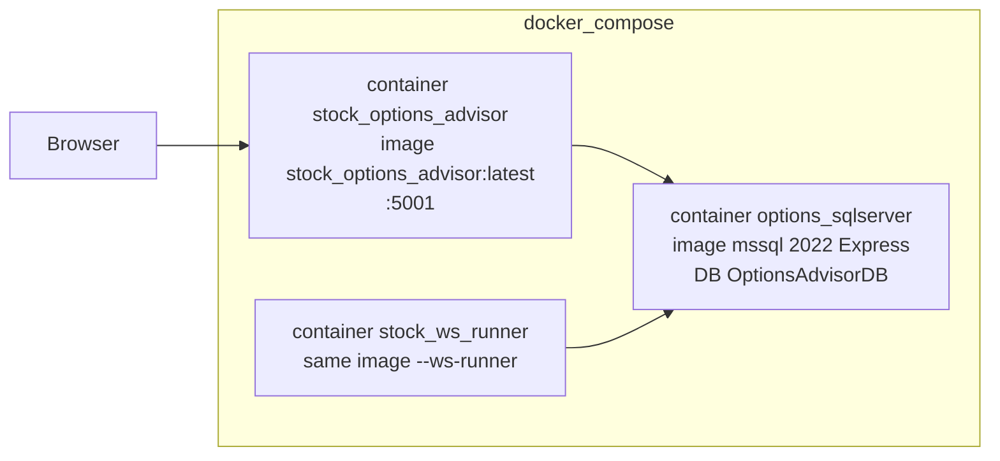
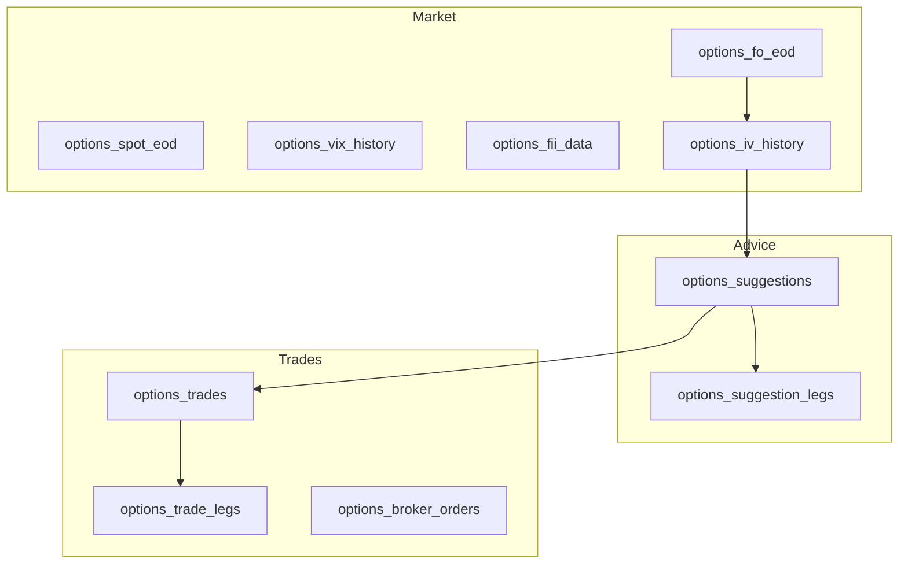
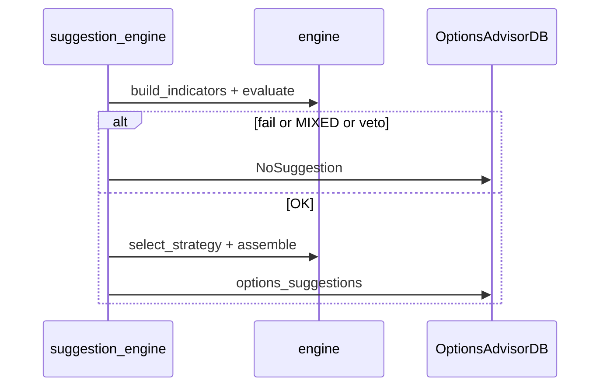
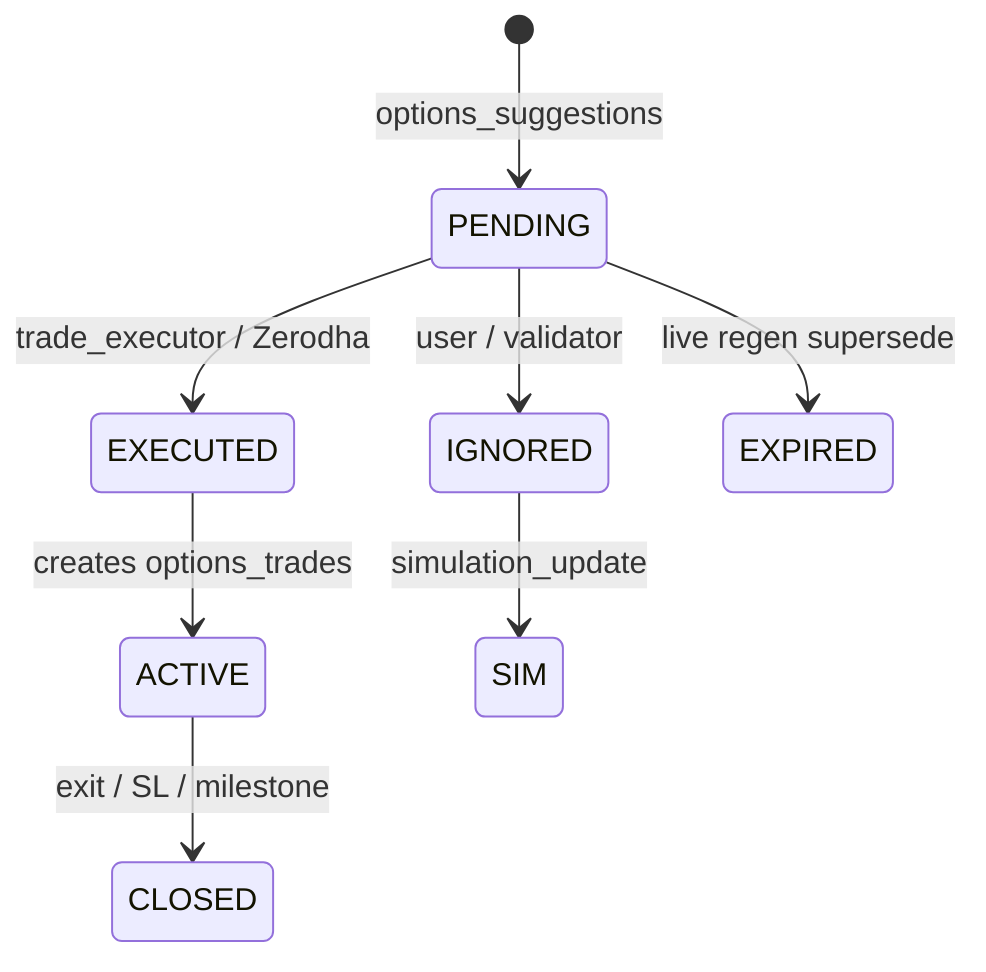
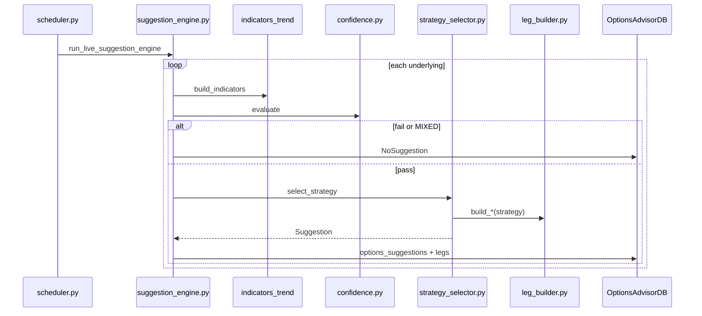
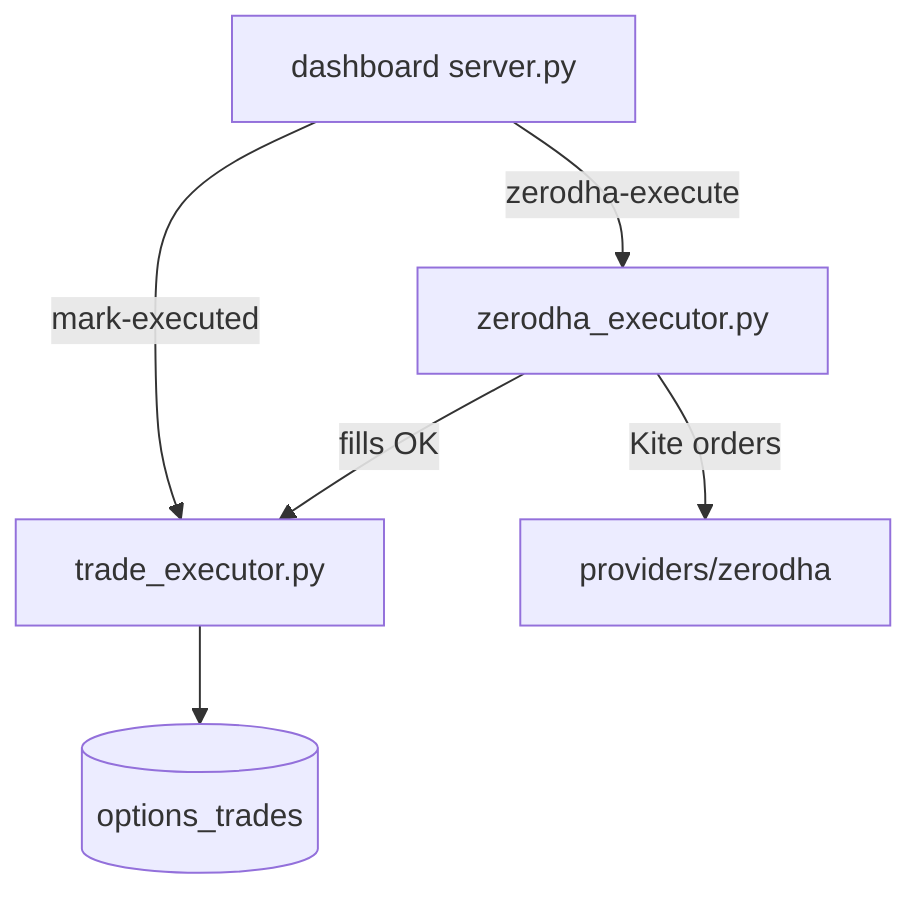
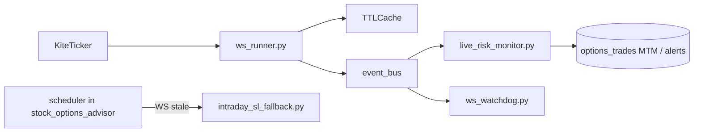

# Options Advisor - Complete Guide

**Last updated:** 2026-09-13

**Single document** for install, day-to-day ops, and architecture.  
Do not recreate `readmefirst.txt`, handbooks, or separate OPERATIONS/SETUP markdown files.


| How to navigate    | Tip                                                                   |
| ------------------ | --------------------------------------------------------------------- |
| **Jump index**     | Click a link below                                                    |
| **Editor Outline** | Auto TOC from headings                                                |
| **Diagrams**       | ASCII always visible; Mermaid needs Markdown Preview (`Ctrl+Shift+V`) |


---

## Jump index

### Part A - Install and operate

- [A1. Landscape](#a1-landscape)
- [A2. Prerequisites](#a2-prerequisites)
- [A3. Bootstrap](#a3-bootstrap)
- [A4. Script catalog](#a4-script-catalog)
- [A5. Clock and jobs](#a5-clock-and-jobs)
- [A6. Secrets](#a6-secrets)
- [A7. Code deploy](#a7-code-deploy)
- [A8. Backup and archive](#a8-backup-and-archive)
- [A9. Troubleshooting](#a9-troubleshooting)


### Part B - Architecture

- [B1. Layers and boundaries](#b1-layers-and-boundaries)
- [B2. Runtime and Docker](#b2-runtime-and-docker)
- [B3. Contracts and exceptions](#b3-contracts-and-exceptions)
- [B4. Configuration](#b4-configuration)
- [B5. Database](#b5-database)
- [B6. Module map](#b6-module-map)
- [B7. Suggestion pipeline](#b7-suggestion-pipeline)
- [B8. Trade lifecycle](#b8-trade-lifecycle)
- [B9. Providers and live](#b9-providers-and-live)
- [B10. Dashboard and alerts](#b10-dashboard-and-alerts)
- [B11. Simulation and scripts](#b11-simulation-and-scripts)
- [B12. Code flows](#b12-code-flows)
- [B13. Change playbooks](#b13-change-playbooks)

---


# Part A - Install and operate


## A1. Landscape

```
                         +---------------------------+
                         | Azure Automation          |
                         | VM start 08:55 / stop 15:45|
                         | Mon-Fri IST               |
                         +-------------+-------------+
                                       |
 +------------------+                  v
 | Windows laptop   |     SSH      +----------------------------------+
 | OptionsAdvisorDB | <----------> | Azure VM                         |
 | _Archive (SQL    |  archive     | container options_sqlserver       |
 | Express)         |  pull 09:15  |   image mssql 2022 Express       |
 | Task Scheduler   |              |   DB OptionsAdvisorDB            |
 +------------------+              | stock_options_advisor :5001      |
                                   | stock_ws_runner (Zerodha ticks)  |
                                   +----------------------------------+
                                              ^
                                              | browser
                                     http://<VmHost>:5001
```


| Piece          | Where                                           | Role                               |
| -------------- | ----------------------------------------------- | ---------------------------------- |
| Dashboard      | VM **:5001**                                    | UI, jobs, config                   |
| Hot DB         | Container `options_sqlserver` / `OptionsAdvisorDB` | Live operational data              |
| Archive DB     | Laptop `OptionsAdvisorDB_Archive`               | Cumulative history                 |
| Manual forever | You                                             | Zerodha login each trading morning |


**Isolation:** never import from / write to equity `stock_analyzer_system` / `StockAnalyzerDB`. Tables here are all `options_`*.

---


## A2. Prerequisites

- [ ] Git, Python 3, Azure CLI, OpenSSH on laptop
- [ ] SQL Server Express + SSMS/sqlcmd on laptop
- [ ] Azure Ubuntu 22.04 VM, `.pem` key, public IP
- [ ] Repo cloned
- [ ] Secrets: DB password, Zerodha API key/secret, `OPT_DASHBOARD_API_KEY`
- [ ] Optional: `OptionsAdvisorDB-*.bak` to restore

---


## A3. Bootstrap

Ask Cursor: *"Follow README.md and bootstrap"*. Agents execute in order:


| Step | Action                                                                                                                                                   |
| ---- | -------------------------------------------------------------------------------------------------------------------------------------------------------- |
| 1    | Copy `deploy/azure/laptop.config.ps1.example` -> `laptop.config.ps1`; fill `VmHost`, `SshKeyPath`, Azure RG/VM, `LocalSqlServer`                         |
| 2    | Copy `.env.docker.example` -> `.env.docker`; fill `MSSQL_SA_PASSWORD`, `OPT_DB_PASSWORD` (same), Zerodha keys, `OPT_DASHBOARD_API_KEY`. **Never commit** |
| 3    | `az login` if needed                                                                                                                                     |
| 4    | `.\deploy\azure\setup-new-environment.ps1` (or `-RestoreFromBackup "PATH\to.bak"`; or `setup-laptop.ps1` only)                                           |
| 5    | `python scripts/validate_setup_sync.py` then `.\deploy\azure\Test-EnvironmentSetup.ps1` until exit 0                                                     |
| 6    | On VM: `git pull` + `chmod +x deploy/*.sh ...` + `./deploy/vm-restart.sh`                                                                                |
| 7    | Report: `http://<VmHost>:5001`, archive DB name, Zerodha login is still manual                                                                           |


**VM-only alternative:** `.\deploy\azure\remote-vm-install.ps1`, or SSH + clone + `.env.docker` + `./deploy/vm-install-deploy.sh`.

---


## A4. Script catalog


| Script                                                                            | Purpose                             |
| --------------------------------------------------------------------------------- | ----------------------------------- |
| `deploy/azure/setup-new-environment.ps1`                                          | Greenfield laptop + VM + uptime     |
| `deploy/azure/setup-laptop.ps1`                                                   | Laptop folders + archive task       |
| `deploy/azure/Test-EnvironmentSetup.ps1`                                          | Verification checklist              |
| `deploy/azure/remote-vm-install.ps1`                                              | VM Docker + app + port 5001         |
| `deploy/azure/VMUpTimeConfiguration.ps1`                                          | Azure start/stop schedules          |
| `deploy/azure/backup-database-to-laptop.ps1` / `restore-database-from-laptop.ps1` | Hot DB move                         |
| `deploy/azure/pull-archive-and-merge.ps1` / `register-laptop-archive-task.ps1`    | Archive pull + ACK                  |
| `deploy/vm-restart.sh` / `deploy/update.sh`                                       | Rebuild/restart app                 |
| `deploy/backup.sh` / `deploy/restore.sh` / `deploy/archive-export.sh`             | VM backup helpers                   |
| `deploy/archive-truncate-vm.sh`                                                   | VM ACK truncate after laptop merge  |
| `scripts/validate_setup_sync.py`                                                  | Repo setup sync check               |
| `scripts/merge_archive_into_local.py`                                             | Merge archive `.bak` into laptop DB |


---


## A5. Clock and jobs

**One place for wall-clock times** (IST, `Asia/Kolkata`). Job *logic* is in Part B; *when* they fire is here.

```
 Mon-Fri (VM up 08:55-15:45)
 08:55  Azure starts VM
 09:00  morning_eod_catchup  (+ events_seed on Monday)
 09:15  Laptop archive task (retry until ACK or ~15:45)
 09:30  Fri: weekly_archive
 09:35  Fri: weekly_log_cleanup | daily: intraday_validator
 09:45 / 11:00 / 13:00 / 14:30  live_suggestion_engine
 14:30  event_eve_review
 15:35  intraday_close_snapshot
 15:36  Fri: archive_export
 15:38  Fri: db_backup
 15:45  Azure stops VM

 Every ~3m during session: intraday_sl_fallback
 Every ~5m during session: pcr_regen_poll
```


| Setting                     | Default                                             |
| --------------------------- | --------------------------------------------------- |
| Log delete keep             | 7 days (`delete_keep_days`)                         |
| Hot historical archive keep | 365 days (`hot_archive_keep_days`)                  |
| VM power script             | `VMUpTimeConfiguration.ps1` (08:55 IST = 03:25 UTC) |


**EOD chain order** inside `morning_eod_catchup` (evening `eod_nightly_pipeline` and solo EOD crons are **off** by default):

`fo_bhav_download` -> `spot_bhav_download` -> `vix_download` -> `fii_download` -> `iv_calculation` -> (`suggestion_engine` **skipped** by default) -> `drift_verifier` -> `simulation_update` -> `exit_engine` -> `trade_greeks_update`

Live cards come from `live_suggestion_engine`, not the skipped EOD suggestion step.

Enable flags / handlers live in `SCHEDULER_CONFIG["jobs"]` and `JOB_FUNCS` in `scheduler/scheduler.py` (not duplicated as a second schedule here).


| Job name                                                                 | Typical         | Notes                         |
| ------------------------------------------------------------------------ | --------------- | ----------------------------- |
| `morning_eod_catchup`                                                    | On @ 09:00      | Runs EOD chain                |
| `live_suggestion_engine`                                                 | On multi-window | Live cards                    |
| `intraday_validator`                                                     | On @ 09:35      | Reprice PENDING               |
| `intraday_close_snapshot`                                                | On @ 15:35      | LTP capture                   |
| `intraday_sl_fallback`                                                   | On every 3m     | If WS stale                   |
| `pcr_regen_poll`                                                         | On every 5m     | Regen hints                   |
| `event_eve_review` / `events_seed`                                       | On              | Events                        |
| `weekly_archive` / `weekly_log_cleanup` / `archive_export` / `db_backup` | Fri             | Archive path                  |
| Solo `fo_bhav_*` … `suggestion_engine`                                   | Usually off     | Available for manual Jobs tab |
| `weekly_cleanup`                                                         | Blocked         | Legacy                        |


---


## A6. Secrets


| File                             | Purpose                                  | Commit? |
| -------------------------------- | ---------------------------------------- | ------- |
| `deploy/azure/laptop.config.ps1` | VM IP, SSH key, Azure RG, local SQL      | **No**  |
| `.env.docker`                    | DB passwords, Zerodha, dashboard API key | **No**  |
| `data/zerodha_session.json`      | Live Kite token                          | **No**  |
| `*.example` templates            | Starters                                 | Yes     |


Trading knobs: `config.py` + DB `options_config` (Part B4).

---


## A7. Code deploy

Keeps DB and trades. **Always** preserve Zerodha session.

```bash
cd ~/options_advisor_system
export COMPOSE_PROFILES=bundled
cp -a data/zerodha_session.json /tmp/zerodha_session.json.bak 2>/dev/null || true
set -a && . ./.env.docker && set +a
git pull origin master
cp -a /tmp/zerodha_session.json.bak data/zerodha_session.json 2>/dev/null || true
docker compose build options_advisor
docker compose up -d
docker compose ps && git log -1 --oneline
```


| Do                              | Don't                                                    |
| ------------------------------- | -------------------------------------------------------- |
| `git pull` + build + `up -d`    | `--fresh-db` / wipe `sqlserver_data` for routine deploys |
| Keep SQL volume                 | Restore unless you intend to replace data                |
| Preserve `zerodha_session.json` | `git reset --hard` over a live session                   |


Dashboard: `http://<VmHost>:5001`

---


## A8. Backup and archive

```
 OptionsAdvisorDB (VM hot)
    | weekly_archive -> *_Archive tables
    | archive_export -> .bak + PENDING.json
    | db_backup      -> OptionsAdvisorDB-latest.bak
    v
 Laptop pull/merge -> OptionsAdvisorDB_Archive
    v
 SSH ACK -> VM truncates exported archive + deletes PENDING (when safe)
```

**Never archive:** `options_config`, `options_runtime_flags`, `options_lot_sizes`, `options_expiry_calendar`, `options_events_calendar`, `options_trade_mtm_snapshot`.  
**Delete-only logs:** `options_system_logs`, `options_job_log`, `options_zerodha_execution_jobs`, `options_notifications`.

Archive jobs run **inside** the app (pyodbc); export uses temp DB `OptionsAdvisorDB_ArchiveExport`, then `.bak` under `./backups` (SQL bind-mount). Friday clock times: [A5](#a5-clock-and-jobs).


| Action                      | Command                                                          |
| --------------------------- | ---------------------------------------------------------------- |
| Register laptop task (once) | `.\deploy\azure\register-laptop-archive-task.ps1`                |
| Manual archive pull         | `.\deploy\azure\pull-archive-and-merge.ps1`                      |
| Hot DB to laptop            | `.\deploy\azure\backup-database-to-laptop.ps1`                   |
| Restore hot to VM           | `.\deploy\azure\restore-database-from-laptop.ps1 -BakPath "..."` |
| On-VM backup/restore        | `./deploy/backup.sh` / `./deploy/restore.sh backups/...bak`      |


ACK refuses if `LAST_HOT_BACKUP.json` is missing or older than this export, `PENDING.json` is missing while `*_Archive` still has rows, or `*_Archive` row counts changed since export.

---


## A9. Troubleshooting


| Symptom               | Check                                                                 |
| --------------------- | --------------------------------------------------------------------- |
| Setup drift           | `python scripts/validate_setup_sync.py` + `Test-EnvironmentSetup.ps1` |
| SSH fails             | VM up? `VmHost` + `.pem` in `laptop.config.ps1`?                      |
| Dashboard down        | Port 5001 NSG, uptime schedule, `docker compose ps`                   |
| Archive stuck         | Laptop task; VM `git pull` + `vm-restart`; ACK conditions above       |
| Zerodha execute fails | `OPT_DASHBOARD_API_KEY` in VM `.env.docker`                           |


---


# Part B - Architecture


## B1. Layers and boundaries

```
  dashboard / alerts          scheduler
         |                        |
         v                        v
      database  <---------  lifecycle  -------->  providers (Zerodha)
                                 |
                                 v
                              engine (pure)
                                 |
                    contracts.py + config.py
```


| Module         | May do                       | Must not                                 |
| -------------- | ---------------------------- | ---------------------------------------- |
| `config.py`    | Values                       | Business logic                           |
| `contracts.py` | Dataclasses                  | I/O / DB                                 |
| `downloader/`  | Fetch + parse                | DB writes / strategy                     |
| `database/`    | SQL only                     | Decisions                                |
| `engine/`      | Pure math / gates / strategy | Import DB, downloader, dashboard, alerts |
| `lifecycle/`   | Orchestrate                  | Own long-lived UI                        |
| `scheduler/`   | Wire jobs                    | Heavy business logic                     |
| `dashboard/`   | Read DB + UI                 | Call engine to pick strategies           |
| `simulation/`  | Shadow ignored cards         | Mutate live trades                       |


Standards: no magic numbers outside `config.py`; explicit DB commit/rollback/close; log to `options_system_logs`; jobs write `options_job_log` + notify; exceptions `RecoverableError` / `JobFailure` / `CriticalError`; `StrategyVeto` = intentional sit-out.

---


## B2. Runtime and Docker

`main.py` modes: default (scheduler + dashboard), `--dashboard-only`, `--scheduler-only`, `--ws-runner`, `--init-db`, `--check-db`, `--zerodha-login` / `--zerodha-logout`, `--provider-status`, `--backfill-index-spot`.



Compose service names: `sqlserver`, `options_advisor`, `ws_runner` (profile `bundled` starts SQL).  
Env: `.env.docker` -> `OPT_DB_*`, `OPT_PROVIDERS`, Zerodha keys, `OPT_DASHBOARD_PORT`, `OPT_DASHBOARD_API_KEY`.  
Volumes: `sqlserver_data`, `./backups`, `./data`, `./logs`, `./archive`.  
Code deploy: [A7](#a7-code-deploy).

---


## B3. Contracts and exceptions

[contracts.py](contracts.py): shared dataclasses only (`MarketIndicators`, `Suggestion`, `NoSuggestion`, bhav rows, …).

[exceptions.py](exceptions.py):


| Type               | Meaning                                 |
| ------------------ | --------------------------------------- |
| `RecoverableError` | Retry / continue                        |
| `JobFailure`       | Job FAILED in `options_job_log`         |
| `CriticalError`    | Infra                                   |
| `StrategyVeto`     | Sit-out -> `NoSuggestion` (not a crash) |


---


## B4. Configuration

```
 config.py defaults  +  .env (infra)  +  options_config (UI)
                              |
                              v
              database.config_overlay -> live STRATEGY_CONFIG
```

Nested JSON overlays: **file default as base**, DB keys win, missing keys filled from file (so old saved blobs cannot hide new knobs).

Major dicts: `DATABASE_CONFIG`, `SCHEDULER_CONFIG`, `STRATEGY_CONFIG`, charges, `DASHBOARD_CONFIG`, `ALERTS_CONFIG`, `RETENTION_CONFIG`, …  
Runtime kill-switches: `options_runtime_flags`.

Trend knobs (high traffic): `trend_sma_*`, `trend_adx_min`, `trend_return_*`, `trend_session_*`. Opposing SMA vs tape -> `MIXED` sit-out; chop SMA is **not** lifted to BEARISH by a 5-10 day dump alone.

---


## B5. Database


| Item        | Value                                                                     |
| ----------- | ------------------------------------------------------------------------- |
| Name        | `OptionsAdvisorDB`                                                        |
| Prefix      | `options_`                                                                |
| DDL         | [database/schema.py](database/schema.py) + `list_tables()`              |
| Archive map | [database/archive_registry.py](database/archive_registry.py)            |
| Access      | [database/connection.py](database/connection.py) + repos in `models.py` |





Other important tables: `options_config`, `options_runtime_flags`, `options_job_log`, `options_system_logs`, `options_notifications`, `options_chain_5min`, `options_atm_iv_5min`, MTM / level-event tables, `options_simulations`, calendars, lot sizes. Full list: `list_tables()`.

---


## B6. Module map

```
options_advisor_system/
├── README.md                 # THIS GUIDE
├── main.py, config.py, contracts.py, exceptions.py, utils.py
├── engine/                   # pure decisions
├── lifecycle/                # job orchestrators
├── database/                 # SQL
├── downloader/               # NSE EOD fetch
├── providers/                # Zerodha / live
├── scheduler/                # APScheduler
├── dashboard/                # Flask :5001
├── simulation/, alerts/, notifications/, scripts/, tests/, deploy/
```


| Change          | Start here                                                         |
| --------------- | ------------------------------------------------------------------ |
| Confidence gate | `engine/confidence.py` + `config.py`                               |
| Strategy / legs | `engine/strategy_selector.py`, `leg_builder.py`                    |
| Trend / MIXED   | `engine/trend_model.py` + suggestion_engine                        |
| New job         | `scheduler/scheduler.py` + `SCHEDULER_CONFIG` + lifecycle `run_*`  |
| New table       | `schema.py` `list_tables()` + archive registry if historical       |
| Live ticks / SL | `providers/zerodha/ws_runner.py`, `lifecycle/live_risk_monitor.py` |
| UI / API        | `dashboard/server.py` (read DB; execute via lifecycle)             |
| **File call chains** | [B12. Code flows](#b12-code-flows)                            |


**Engine highlights:** `indicators`, `trend_model`, `confidence`, `strategy_selector`, `leg_builder`, `iv_`*, `charges`, exit/greeks helpers.  
**Lifecycle highlights:** `download_orchestrator`, `iv_orchestrator`, `suggestion_engine`, `trade_executor` / `zerodha_executor`, `live_risk_monitor`, validators, archive/sql_backup jobs.

---


## B7. Suggestion pipeline

```
  spot + chain + history
        -> build_indicators  (trend: BULLISH|BEARISH|SIDEWAYS|MIXED)
        -> confidence.evaluate
              fail -> NoSuggestion
              MIXED -> NoSuggestion (sit-out; not Iron Condor)
              pass  -> select_strategy + legs + charges
                         StrategyVeto -> NoSuggestion
                         else -> options_suggestions (+ legs)
```




| Effective trend              | Outcome                           |
| ---------------------------- | --------------------------------- |
| Agreeing BULLISH / BEARISH   | Directional strategies by IV zone |
| SIDEWAYS (true chop)         | Condor / calendar / regime pair   |
| MIXED (SMA vs tape disagree) | Sit out                           |


Jobs: EOD data via [A5](#a5-clock-and-jobs); cards via `live_suggestion_engine`. Downloader writes raw shapes only; lifecycle persists.  
**Which files:** [B12](#b12-code-flows).

---


## B8. Trade lifecycle

Suggestion statuses vs trade statuses (separate tables):



Monitoring: WS ticks -> `live_risk_monitor` (MTM, profit/loss milestones with confirm); fallback job `intraday_sl_fallback`; daily `exit_engine`.  
**Which files:** [B12](#b12-code-flows).

---


## B9. Providers and live

[providers/zerodha/](providers/zerodha/): session, quotes, `ws_runner`, orders, rate limit.  
Process: `stock_ws_runner` writes `options_chain_5min` / `options_atm_iv_5min`.  
Leg **pricing provenance** (`LIVE` | `EOD` | `MIXED`) is unrelated to trend label `MIXED`. Preserve `data/zerodha_session.json` across deploys ([A7](#a7-code-deploy)).

---


## B10. Dashboard and alerts

Flask on **:5001** (`dashboard/server.py`). Reads DB; execution calls lifecycle.  
Notifications -> `options_notifications` (+ optional email via `alerts/`). Sit-outs must show a clear reason.

Sit-out banners (`engine/market_regime.py`) say **IV rank** (vs own history), not raw “cheap IV”. When rank is low but **IV/HV > 1**, the title is “options still rich vs HV” so it does not contradict the expensive-vs-realised soft-fail.

**Paper vs Zerodha:** “Record at suggested / Record my fills” always stamps `execution_provider=manual`. Never copy suggestion `provider` (that is the market-data feed, often `zerodha` in live mode). The Zerodha execution channel requires COMPLETE ENTRY/SUPPLEMENT fills on Kite — the provider stamp alone never authorizes live EXIT. Close / auto-close / flatten-rollback always verify matching Kite net inventory (gate cannot be disabled). Dashboard “Close in Zerodha” is hidden for paper/manual trades. Entry margin gate uses the **placement path peak** (prefix basket margins in execution order), not only the final structure total, plus the configured buffer. Suggestion **Amount needed** shows engine capital plus Zerodha Final/Peak when ready (preview quotes margin even if individual legs are outside band); the Execute confirm popup also shows the live per-unit debit/credit equation and Final vs Max required. Multi-leg place gates pass when **structure net** credit/debit is at or better than the combined band floor even if individual legs sit outside their own bands (missing quotes still block).

---


## B11. Simulation and scripts

Job `simulation_update`: shadow ignored suggestions -> `options_simulations` / legs.  
`scripts/`: inspect, validate, analyze — not on the hot scheduler path.

---


## B12. Code flows

Quick answers, then the call chains. Preview Mermaid with `Ctrl+Shift+V`.

### Quick map


| Question | Answer |
| --- | --- |
| Separate file per strategy? | **No.** One picker + one leg builder. |
| Who picks the strategy name? | `engine/strategy_selector.py` → `select_strategy()` |
| Who builds the legs? | `engine/leg_builder.py` → `build_iron_condor()`, `build_bull_put_spread()`, … |
| Who runs the suggestion job? | `lifecycle/suggestion_engine.py` (`run_live_suggestion_engine` / `run_suggestion_engine`) |
| Who wires the job clock? | `scheduler/scheduler.py` + `SCHEDULER_CONFIG` |
| Manual “mark executed”? | `lifecycle/trade_executor.py` → `mark_executed()` |
| Real Zerodha orders? | `lifecycle/zerodha_executor.py` → `execute_suggestion_in_zerodha()` |
| Dashboard API entry? | `dashboard/server.py` (`/api/suggestion/.../zerodha-execute`, `mark-executed`, …) |
| WS ticks? | `providers/zerodha/ws_runner.py` (container `stock_ws_runner`) |
| Who acts on ticks for open trades? | `lifecycle/live_risk_monitor.py` (same process as WS runner) |


```
  STRATEGY PICK (one file)          LEG BUILD (one file, many functions)
  strategy_selector.py              leg_builder.py
    select_strategy()  ---------->    build_iron_condor()
    assemble_suggestion() -------->   build_bull_put_spread()
         |                            build_bear_call_spread()
         |                            build_calendar_spread()
         v                            build_jade_lizard()
    Suggestion dataclass              build_long_* / debit spreads ...
```

Strategies today are **string codes** (e.g. `IRON_CONDOR`), not classes/files. Adding a strategy = new branch in `select_strategy` + new `build_*` in `leg_builder` + registry entry in `assemble_suggestion`.

---

### Flow 1 — Suggestion generation

Scheduler (or Jobs tab) calls the lifecycle entrypoint; engine stays pure (no DB).

```
  scheduler.job_live_suggestion
       |
       v
  lifecycle/suggestion_engine.py
       run_live_suggestion_engine()   or   run_suggestion_engine()
       |
       +-- for each underlying in STRATEGY_CONFIG["underlyings"]:
       |         _evaluate_underlying()
       |              |
       |              +-- load chain/spot (LIVE: providers/zerodha; EOD: database)
       |              +-- engine/indicators.py          build_indicators()
       |              |       includes engine/trend_model.py   (BULLISH|BEARISH|SIDEWAYS|MIXED)
       |              +-- engine/confidence.py          evaluate()
       |              |       fail / MIXED  -->  NoSuggestion
       |              +-- engine/strategy_selector.py   select_strategy()
       |              +-- engine/strategy_selector.py   assemble_suggestion()
       |              |       --> engine/leg_builder.py build_*()
       |              |       --> engine/charges.py, name_generator, …
       |              +-- StrategyVeto / sizing fail --> NoSuggestion
       |
       +-- _persist_and_notify()
              --> database models --> options_suggestions (+ legs)
              --> notifications
```



Live vs EOD difference: **same** `_evaluate_underlying` path; live pulls chain/spot from Zerodha provider and tags `data_source=LIVE`. EOD uses NSE bhav tables.

---

### Flow 2 — Execute a trade (manual fill vs Zerodha)

```
  Browser dashboard
       |
       +-- POST /api/suggestion/<id>/mark-executed
       |         dashboard/server.py
       |              --> lifecycle/trade_executor.mark_executed()
       |                    writes options_trades + legs (your fill prices)
       |                    suggestion status --> EXECUTED
       |
       +-- POST /api/suggestion/<id>/zerodha-execute
                 dashboard/server.py
                      --> lifecycle/zerodha_executor.execute_suggestion_in_zerodha()
                            |  (or *_async job + poll)
                            +-- providers/zerodha session / InstrumentMaster
                            +-- place + monitor each leg (Kite)
                            +-- on success: trade_executor.mark_executed(...) with broker fills
                            +-- on partial fail: rollback helpers in same file
```



Close path mirrors this: `close_trade_with_fills` vs `close_trade_in_zerodha` / `*_async`.

---

### Flow 3 — WebSocket ticks and live risk

Two Docker processes share the DB; ticks live in the **WS runner** process only.

```
  main.py --ws-runner          (container stock_ws_runner)
       |
       +-- providers/zerodha/ws_runner.py   KiteWSRunner
       |         _on_ticks --> _handle_tick
       |              +-- TTL quote cache
       |              +-- event_bus.publish(scoped topic, LiveQuote)
       |              +-- (also order postbacks --> order_updates.py)
       |
       +-- lifecycle/live_risk_monitor.py   LiveRiskMonitor
       |         subscribed to same event_bus
       |              +-- MTM, milestones, SL / exit alerts
       |              +-- status file for dashboard WS monitor
       |
       +-- providers/ws_watchdog.py / ws_health.py
                 dead-man if ticks go stale

  Fallback (app container scheduler, not WS process):
       intraday_sl_fallback  -- if WS unhealthy, quote REST / act carefully
```



`subscription_manager.py` decides which option tokens to subscribe (open trade legs + watchlist). Dashboard does **not** receive raw ticks over HTTP for decisioning; it reads DB / status snapshots.

---

### Flow 4 — Morning data before live cards

```
  09:00 morning_eod_catchup   (scheduler.py)
       --> download_orchestrator / fo+spot+vix+fii downloaders
       --> iv_orchestrator
       --> drift_verifier, simulation_update, exit_engine, trade_greeks_update
       --> suggestion_engine step SKIPPED (live windows own cards)
  09:45+ live_suggestion_engine windows
```

Full wall-clock: [A5](#a5-clock-and-jobs).

---

## B13. Change playbooks

After any **impactful** change: update **this README** in the section that already owns the topic (do not invent parallel docs or fluff). Then:

```bash
python scripts/validate_setup_sync.py
pytest tests/test_database/test_schema.py tests/test_scheduler/test_scheduler.py -q
```


| Change                  | Touch                                                                                          |
| ----------------------- | ---------------------------------------------------------------------------------------------- |
| Confidence gate         | `engine/confidence.py`, `config.py`, `tests/test_engine/`, README B7 / B12                      |
| Strategy                | `strategy_selector.py`, `leg_builder.py`, tests, README B7 / B12                                |
| Trend / MIXED           | `trend_model.py`, `suggestion_engine.py`, tests                                                |
| Table                   | `schema.py` `list_tables()`; archive registry if historical; README B5 / A8 never-archive list |
| Job                     | `SCHEDULER_CONFIG`, `JOB_FUNCS`, lifecycle `run_*`, dashboard job meta, README A5              |
| Deploy / archive script | README A4 / A8; `setup-new-environment.ps1` / manifest if greenfield-visible                   |
| New module / boundary   | README B1 / B6 / B12                                                                           |
| Code-only ship          | [A7](#a7-code-deploy)                                                                          |


**Agent shorthand:** saying **deploy** means document (if needed) → commit → push → VM deploy (A7).

**Definition of done:** code + tests + lean README update when impactful + `validate_setup_sync.py` clean when setup-related.

---

*End of guide. Keep everything in this* `README.md`*.*